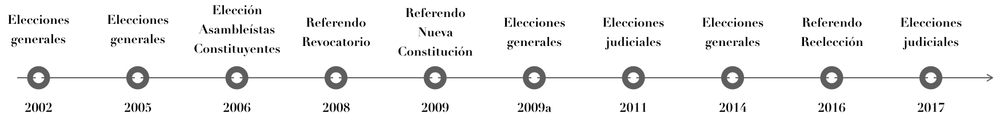

<br>
<center><h4>15 años, 10 procesos: Apoyo electoral a Evo Morales y MAS-IPSP</h4></center>
<br>
```{r setup, include=F, echo=F}


library(geojsonio)
library(tidyverse)
library(highcharter)
library(magrittr)
library(rio)

mun <- jsonlite::fromJSON("municipios.339.geojson", 
                          simplifyVector = F)
a <- import("final.xlsx")

ds1 <- a %>% 
  group_by(CODIGO) %>% 
  do(item = list(
    CODIGO = first(.$CODIGO),
    sequence = .$MAS,
    value = first(.$MAS))) %>% 
  .$item

hc <- highchart(type = "map") %>% 
  hc_add_series(data = ds1,
                name = "Porcentaje de votos EVO/MAS-IPSP",
                mapData = mun,
                joinBy = "CODIGO",
                borderWidth = 0.01) %>% 
  hc_colorAxis(stops = color_stops()) %>%  
  hc_legend(layout = "vertical", reversed = TRUE,
            floating = TRUE, align = "right") %>% 
  hc_add_theme(hc_theme_smpl()) %>% 
  hc_motion(enabled = TRUE, loop = FALSE, autoPlay = TRUE,
    axisLabel = "año",
    labels = sort(unique(a$FECHA)),
    series = 0,
    updateIterval = 50,
    magnet = list(
      round = "floor",
      step = 0.01
    )
  )
```

```{r include=T, echo=FALSE}
hc
```
<br>
<br>
<br>
<br>
<center></center>
<br>
<br>
<small>[Metodología](https://www.youtube.com/watch?v=Qn4esVrGjhI) | [Soundtrack](https://www.youtube.com/watch?v=Qn4esVrGjhI)</small>

